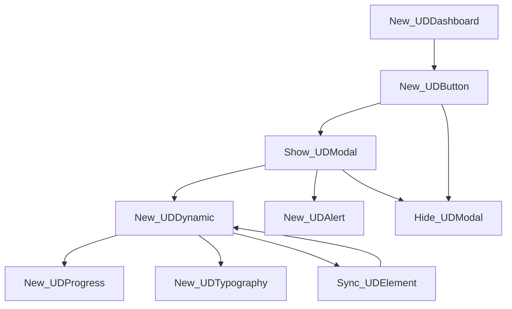

### Explanation of Session Variables and Scoping in Powershell Universal Dashboard

#### Why Use `$Session:PercentComplete`?
- **Persistent State**: The session variable retains its value and is accessible within different components of your dashboard, such as inside `New-UDDynamic` and when `Sync-UDElement` is called.
- **Shared Context**: It provides a shared context for all components running in the same user session, ensuring updates are reflected correctly when the UI is refreshed.

#### Why `$PercentComplete` without `Session:` Fails
- **Variable Scope**: `$PercentComplete` is only recognized in the scope where it's declared. If it's used inside `New-UDDynamic`, the dashboard <mark>won't know its value when `Sync-UDElement` triggers an update because it's considered a new script block.
- **State Reset**: When `Sync-UDElement` runs, it doesn’t have access to non-session variables outside of its own scope, leading to failures when trying to update or reference them.

### Using Session Variables (`$Session:Variable`)
- **Scoping Benefits**: `$Session:` variables are accessible across different script blocks within the same user session, making them perfect for cases where you need to share or update a variable's state across multiple UI updates.
- **Compatibility with `Sync-UDElement`**: `Sync-UDElement` can successfully update a `New-UDDynamic` element because it can access session variables that persist beyond the scope of individual script blocks.

### Solution Recap
To ensure variables persist across updates, stick to using `$Session:` for any variable that needs to be accessed or updated in multiple script blocks or by `Sync-UDElement`.

### Example with a progress bar

```powershell
# Using a session variable for compatibility across UI updates
$Session:PercentComplete = 0  # Initialize the session variable

New-UDDashboard -Title 'Teams instance manager' -Content {
    New-UDButton -Text 'Load data' -OnClick {
        # Initialize the session variable. Using $Session:PercentComplete allows the variable to persist
        # across different scopes and updates within Universal Dashboard. This ensures that the
        # progress bar can access and update the variable even when the UI is refreshed.
        $Session:PercentComplete = 0

        # Display a modal with an initial progress bar and a message.
        Show-UDModal -Content {
            # Create a dynamic container to hold the progress bar. This container will be updated later
            # using Sync-UDElement, which re-renders the content with the current value of $Session:PercentComplete.
            New-UDTypography -Text "Busy loading data"
            New-UDDynamic -Id 'progressDynamic' -Content {
                # Display the initial progress bar with the current percent complete.
                New-UDProgress -circular -PercentComplete $Session:PercentComplete
            }
        } -FullWidth

        # Incrementally update the progress in a loop.
        # The $Session:PercentComplete variable is updated within the loop, and Sync-UDElement ensures
        # that the 'progressDynamic' element is refreshed to reflect the new value.
        1..4 | ForEach-Object {
            $Session:PercentComplete += 25  # Increment the progress by 25%
            Sync-UDElement -Id 'progressDynamic'  # Refresh the content of 'progressDynamic' with the updated value
            Start-Sleep -Seconds 2  # Simulate work being done by pausing for 2 seconds
        }

        # Hide the modal after the loop is complete, indicating that the data loading process is finished.
        Hide-UDModal

        # Show a success modal to inform the user that the process is complete.
        Show-UDModal -Content {
            # Display a success alert inside the modal.
            New-UDAlert -Severity 'Success' -Title 'Success' -Text 'Finished loading data' -Id 'alert5'
        } -FullWidth

        # Wait for 2 seconds to allow the user to read the success message, then hide the modal.
        Start-Sleep -Seconds 2
        Hide-UDModal
    }
}

```

### Explanation as to Why an Additional `New-UDDynamic` Is Not Needed

#### 1. **Purpose of `New-UDDynamic`**
- `New-UDDynamic` is used to create a component that can be refreshed or updated using `Sync-UDElement`.
- When you call `Sync-UDElement`, it re-renders the content defined within the `New-UDDynamic` block.
- If you need to refresh different parts of the UI independently, using multiple `New-UDDynamic` components is the best approach. 
Each dynamic component can be targeted individually with `Sync-UDElement` by specifying its unique -Id.

```powershell
New-UDDynamic -Id 'dynamic1' -Content {
    # Content that can be refreshed separately
}

New-UDDynamic -Id 'dynamic2' -Content {
    # Another part that can be refreshed independently
}
```

#### 2. **Placement of `New-UDDynamic`**
- In the provided example, `New-UDDynamic` is placed inside `Show-UDModal` to wrap the progress bar.
- This placement ensures that `Sync-UDElement` can target this specific component and update it during the loop.

#### 3. **Why No Additional `New-UDDynamic` Is Needed**
- Once `New-UDDynamic` is defined inside the modal with a unique `-Id` (e.g., `'progressDynamic'`), `Sync-UDElement` can refresh that specific component directly.
- The `Show-UDModal` block itself is not dynamic, but the `New-UDDynamic` within it allows `Sync-UDElement` to update it.
- You don't need to add another `New-UDDynamic` outside the modal, as the updates only need to happen within the modal.

#### 4. **What Would Happen If You Added Another `New-UDDynamic`**
- Adding another `New-UDDynamic` outside the modal would create a separate dynamic component that `Sync-UDElement` would target.
- This would be redundant and potentially confusing, as only the dynamic content inside the modal (`'progressDynamic'`) needs to be updated.

### Key Points
- The `New-UDDynamic` block acts as a refreshable container for the progress bar.
- `Sync-UDElement` uses the `-Id` parameter to locate and refresh the existing `New-UDDynamic` content without needing additional dynamic containers.
- Placing `New-UDDynamic` inside `Show-UDModal` allows it to be part of the modal's content while remaining refreshable.

### Summary
- The provided example is efficient because it wraps the progress bar in a single `New-UDDynamic` block inside the modal.
- This ensures that `Sync-UDElement` can update just that part without needing further dynamic components.

# Interaction of Universal Dashboard Cmdlets



- **New-UDDashboard**: Initiates the dashboard and serves as the top-level container.
- **New-UDButton**: Triggers actions when clicked and leads to commands like **Show-UDModal**.
- **Show-UDModal**: Displays a modal window that can contain elements like **New-UDDynamic**.
- **New-UDDynamic**: Acts as a container for dynamic content such as **New-UDProgress** or **New-UDTypography** and can be refreshed with **Sync-UDElement**.
- **Sync-UDElement**: Refreshes the content inside a **New-UDDynamic** component.
- **Hide-UDModal**: Used to close the modal.
- **New-UDAlert**: Can be shown within the modal for success or alert messages.
